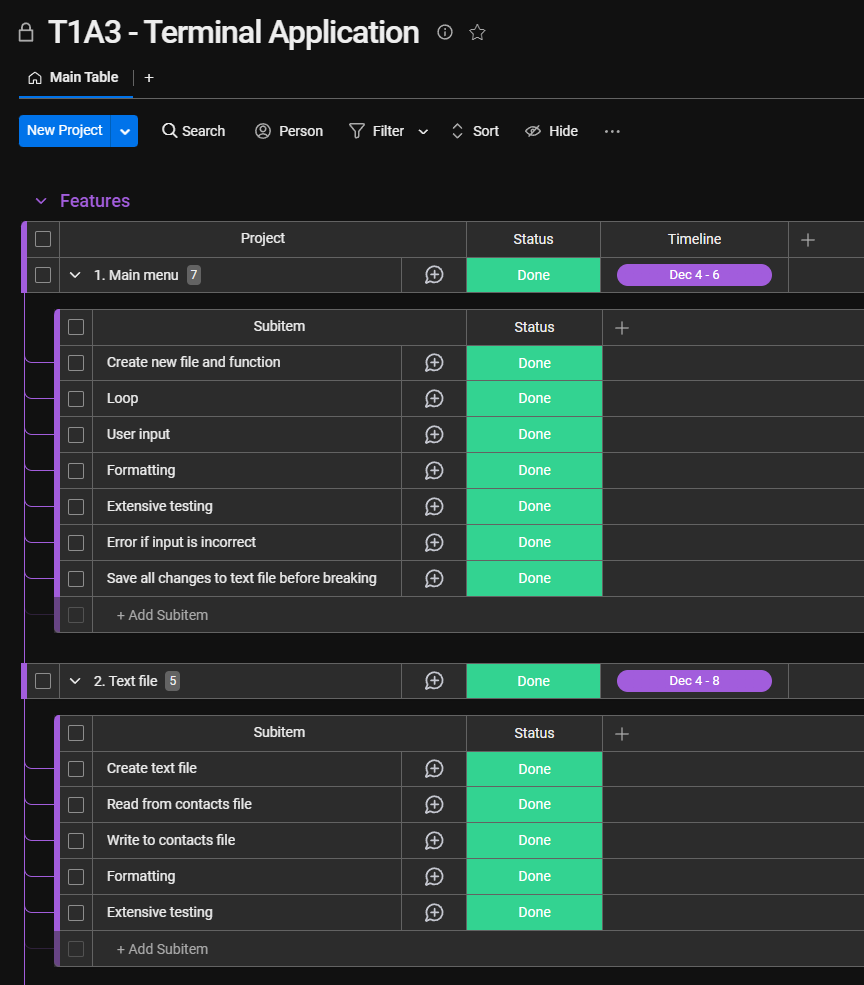
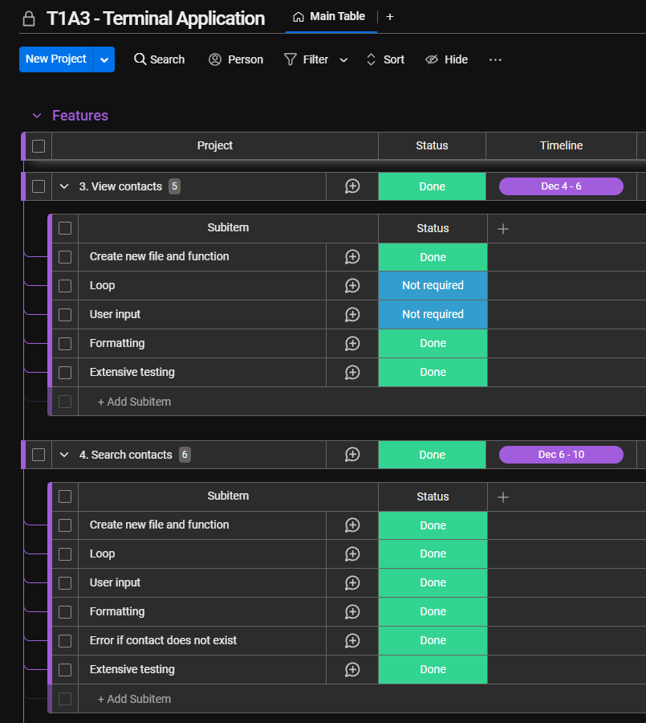
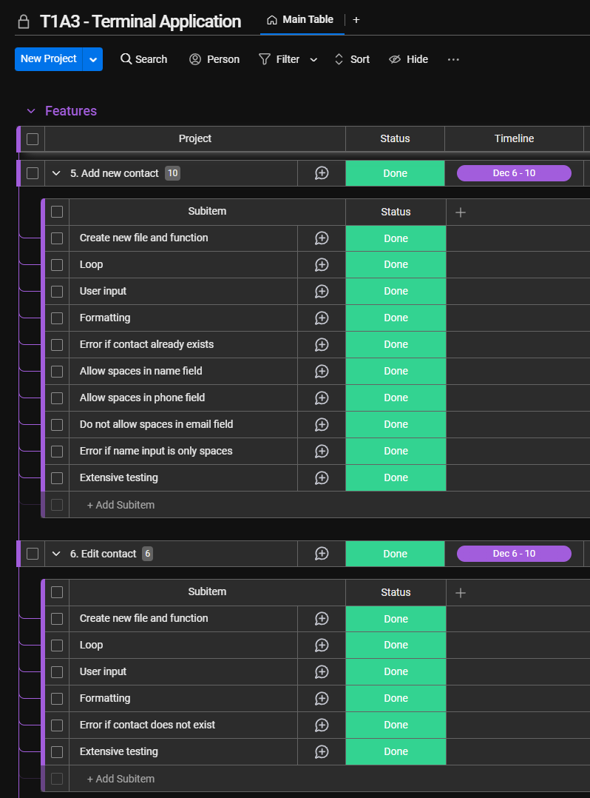
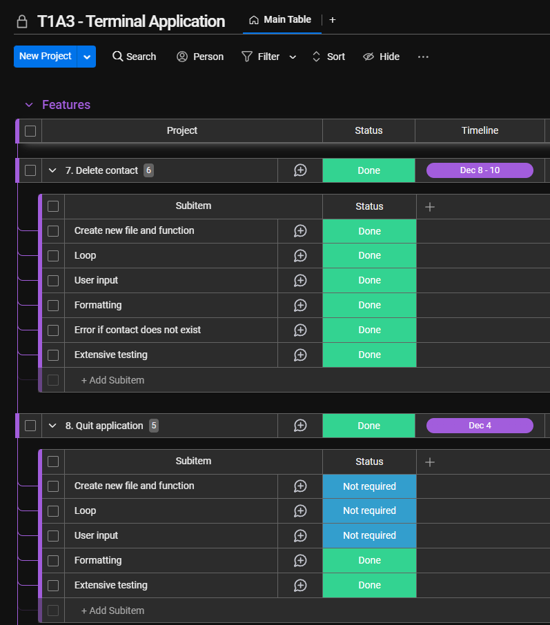

# **Luke Mastrocola**
# **ID:** T1A3 | **Title:** Terminal Application (Contact Book)
<br>


## **R3** - Provide full attribution to referenced sources (where applicable).
<br>
(1) "PEP 8 – Style Guide for Python Code" - https://peps.python.org/pep-0008/

(2) General research: 

Throughout this project I used Google to search for specific questions and any roadblocks. I found many posts on the following websites.

https://www.w3schools.com/ <br>
https://www.youtube.com/ <br>
https://stackoverflow.com/ <br>
https://www.codecademy.com/ <br>
https://www.freecodecamp.org/ <br>
https://www.howtogeek.com/ <br>
https://apple.stackexchange.com/ <br>

<br>
<br>

## **R4** -Provide a link to your source control repository
<br>

**Github repository**: https://github.com/mastra90/-Assignment-T1A3---Terminal-Application-

**Presentation video**: https://youtu.be/UGpePhjOs5E

<br>
<br>

## **R5** - Identify any code style guide or styling conventions that the application will adhere to.Reference the chosen style guide appropriately.
<br>
For this project I am PEP 8 as the style guide.

<br>
<br>

## **R6** - Develop a list of features that will be included in the application. It must include at least THREE features (and) describe each feature.
<br>

**Feature 1 - Main menu**

Upon entry to the application, the user will be greeted with a welcome message and a main menu with 6 options. The options are as follows:

1. View all contacts
2. Search contacts
3. Add new contact
4. Edit a contact
5. Delete a contact
6. Quit application

The required input is a number from 1-6. There is a loop which determines which input the user has entered. If the user enters anything that is not in the range of numbers from 1-6 then an error will display saying that they have provided an invalid input before looping back to the main menu.
 
<br>

**Feature 2 - View all contacts**

When the user enters '1', a function runs that shows the user all contacts in the contacts book. The data contained in each entry is the contact's name, phone number and email address.
 
<br>

**Feature 3 - Search contacts**

When the user enters '2', a function runs that allows the user to search their contacts. Upon a successful search, it shows them their requests contact's name, phone number and email address. If the user enters a name that is not in the contacts book an error displays that tells the user that the contact is not found. It advises that the search is case sensitive and to enter the full name of the contact. It also provides a tip that if they're unsure of the name of the contact, they can view all contacts to have a look.
 
<br>

**Feature 4 - Add new contact**

When the user enters '3', a function runs that allows the user to add a new contact. They are asked for the contact's full name, phone number and email address. The name and phone number field allow spaces which reflects correctly when the user views contacts. If the user only enters white spaces in name field then an error is displayed saying not to use only spaces. If the user enters a space in the email field, an error occurs saying not to use spaces in emails. If the name they have entered already exists, then an error tells the user that the contact they are trying to add already exists.
 
<br>

**Feature 5 - Edit a contact**

When the user enters '4', a function runs that allows the user to edit an existing contact. It asks the who they would like to edit and if the name they enter exists in the contact book they have the ability to edit the phone number and email address. If the name the enter does not exist, then an error tells the user that the contact they are trying to edit does not exist. If the user enters a space in the email field, an error occurs saying not to use spaces in emails.
<br>

**Feature 6 - Delete a contact**

When the user enters '5', a function runs that allows the user to delete an existing contact. It asks the who they would like to delete and if the name they enter exists in the contact book then the contact is removed from the contact book. If the name the enter does not exist, then an error tells the user that the contact they are trying to delete does not exist.
 
<br>

**Feature 7 - Data retention**

Any changes the user makes to the contact book is saved to a text file and the application reads the information directly from the same text file. This means that if the user makes any changes such as adding, editing or deleting contacts that the data is stored and saved for when the application is closed and opened again.

<br>
<br>

## **R7** - Develop an implementation plan which outlines how each feature will be implemented and a checklist of tasks for each feature, prioritise(s) the implementation of different features, or checklist items within a feature (and) provide a deadline, duration or other time indicator for each feature or checklist/checklist-item. Utilise a suitable project management platform to track this implementation plan. Provide screenshots/images and/or a reference to an accessible project management platform used to track this implementation plan. Your checklists for each feature should have at least 5 items.
<br>

I used monday.com as my project management platform to keep track of my features.
This platform provides the ability to organize workflow in anyway that is required. It has the ability to provide different status' as well as add additional custom status'. It has a timeline feature and the ability to add comments to each entry.

Here is a screenshot of the features that I used: status, time range and comments:


See the following screenshots of the entire project:










<br>
<br>


## **R8** - Design help documentation which includes a set of instructions which accurately describe how to use and install the application.

## You must include:
- steps to install the application
- any dependencies required by the application to operate
- any system/hardware requirements
- how to use any command line arguments made for the application

<br>
<br>


**SYSTEM REQUIREMENTS**: <br>
**Compatible OS**: Windows, MAC OSX or LINUX <br>
**Required installations**: Your operating system's terminal with WSL

<br>

**INSTALLATION**:

Window: <br>

1. Once you have downloaded the application, move all contents of the download to a folder. Name the folder to what you wish such as "Contact Book".

2. In Windows Explorer, navigate to the folder where the application files are now placed. At the top the windows, click on the empty space in the file path and type 'cmd' then press Enter. This will open the Command Prompt. Once the Command Prompt has opened type ```bash``` and press enter.. If you receive an error, complete step 3 before moving onto step 4. If you did not receive an error, skip step 3.

3. If you get an error then you will need to install what is required to run the application. Exit the Command Prompt and click the start menu and type 'cmd'. Right click Command Prompt and click "Run as Administrator". Once Command Prompt opens type ```wsl --install``` and press Enter. This will install what is required to run the application. When it is finished you will see a message that says "The requested operation is successful. Changes will not be effective until the system is rebooted." Reboot you computer (make sure to click 'Restart' and not 'Shutdown') Once the computer reboots, the installation will automatically continue in the Command Prompt. It will ask you to make a username and password. Make a username and password that will be secure but easy for you to remember. Exit Command Prompt and repeat step 2.

4. After you have entered ```bash``` into Command Prompt, type ```./run.sh``` and press Enter. This will launch the application in the Command Prompt. if you are prompted to enter your username and password then enter your username and password and press enter to continue.

Mac OSX: <br>
1. Once you have downloaded the application, move all contents of the download to a folder. Name the folder to what you wish such as "Contact-Book". Make sure to not use spaces in the name of the folder. If you wish to use more than one word then use a dash or underscore to separate the words. Move the folder somewhere easy to remember such as your Documents folder or Desktop.

2. Using the keyboard shortcut 'cmd+space', search for 'terminal' and press Enter. Once the terminal opens type ```bash``` and press Enter. If you receive an error, complete step 3 before moving onto step 4. If you did not receive an error, skip step 3.

3. If you get an error that says "invalid active developer path" then you will need to install what is required to run the application. In terminal type ```xcode-select --install``` and press Enter. This may take several minutes to install. Once it has finished, close the terminal and repeat step 2.

4. Once you have entered ```bash``` into the terminal, type ```cd``` then a single space followed by the relative path of the folder where you placed the application. For example: if you named the folder "Contacts-Book" and placed it in your Documents folder then you would type: ```cd Documents/Contact-Book```

5. After you have successfully entered your file path type ```./run.sh``` and press Enter to launch the application.

Linux: <br>

1. Once you have downloaded the application, move all contents of the download to a folder. Name the folder to what you wish such as "Contact-Book". Make sure to not use spaces in the name of the folder. If you wish to use more than one work then use a dash or underscore to separate the words. Move the folder somewhere easy to remember such as your Documents folder or Desktop.

2. Open the terminal and type ```cd``` then type a single space followed by the relative path of the folder where you placed the application. For example if you named the folder "Contacts-Book" and placed it in your Documents folder then you would type ```cd Documents/Contact-Book```

5. After you have successfully entered your file path type ```./run.sh``` and press Enter to launch the application.

<br>

**HOW TO USE**:

When you first start the application, you will see the main menu. To navigate the menu press a number between 1-6 to navigate to your desired option. The menu options are as follows:

1. View all contacts
2. Search contacts
3. Add new contact
4. Edit a contact
5. Delete a contact
6. Quit application

<br>

**VIEWING CONTACTS**

To view all contacts, press '1' from the main menu. <br>
To go back to the main menu, press 'Enter'.

<br>

**SEARCHING CONTACTS**

To Search contacts, press '2' from the main menu. You will be asked to enter the contact that you'd like to search. Enter the full name of your contact and press enter to see the search result.

*Please note*: <br> 
You must search for the full name of the contact. <br>
The search is case sensitive.

<br>

**ADDING CONTACTS**

To add a contact, press '3' from the main menu. You will be prompted to enter the full name, phone number and email address of the contact you would like to add. After you have entered your contact you will be able to see them by pressing '1' from the main menu to view all contacts. <br>

*Please note*: <br> 
You cannot add a new contact with the same name as an existing contact. <br>
You cannot add a contact that only uses spaces for the name. <br>
You cannot add an email address that uses any spaces. <br>

<br>

**EDITING CONTACTS**

To edit a contact, press '4' from the main menu. You will be prompted to enter the full name of the contact you would like to edit. If your contact exists in the contacts book you will be prompted to enter the new phone number and email address. If you would only like to change one thing, then you can enter the same details in the field that you do not wish to change.

*Please note*: <br> 
You must search for the full name of the contact. <br>
The search is case sensitive. <br>
You cannot change a contact's email address to one that uses any spaces. <br>
You cannot change a contact's name. If you wish to change a contact's name then delete the contact and create a new contact with the updated name.

<br>

**DELETING CONTACTS**

To edit a contact, press '5' from the main menu. You will be prompted to enter the full name of the contact you would like to edit. If your contact exists in the contacts book then the contact will be deleted.

*Please note*: <br> 
You must search for the full name of the contact. <br>
The search is case sensitive. <br>

<br>

**QUITTING THE APPLICATION**

To quit the application, press '6' from the main menu and close exit the terminal. 


<br>
<br>
<br>
<br>
<br>
<br>


